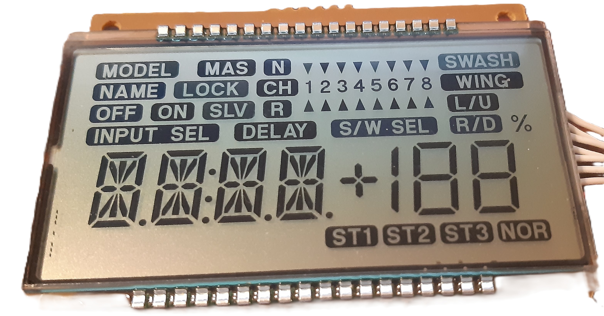

# upd7225
An Arduino library to operate the display of a modified ECLIPSE7 RC controller, based on uPD7225 display controller.


## Supported microcontrollers
This library does not depend on hardware specific code. It can support microcontrollers having at least 5 available pins, or 6 pins if the BUSY signal is supported. It can also operate the LCD using a port extender such as the PCF8574, if the microcontroller supports I2C.

## How to install
This library can be installed in two ways, ether by using the manual mode or by using the Arduino library editor.

### Manual installation
Click on the "Clone or download" button in the upper right corner, and then "Download ZIP". Exctract the ZIP file, and move the extracted folder to the location "~/Documents/Arduino/libraries". Create the "libraries" folder if it doesn't exist. Open Arduino IDE, and a new library called "upd7225" will show up under the "examples" menu.

### Library manager installation
The library is also available through Arduino's library manager. <br/> 
To open the library manager, in the IDE click on `Sketch` -> `Include Library` -> `Manage Libraries` <br/>
Then search for <b>upd7225</b>.

## About the LCD
The LCD comes from an old and beyond repair ECLIPSE7 RC transmitter. Under a project to build a PC joystick using the potentiometers and switches of the RC transmitter, the idea came to use the display for the purpose of applying configuration parameters to the joystick. 

<br/> <br/>


The display is based on NEC uPD7225 display controller. In a search for an existing library, I found https://github.com/MCUdude/KTMS1201/. Unfortunately, the ECLIPSE7 LCD needs to support the multiple symbols of the LCD, instead of the "standard" alphanumeric symbols of the KTMS1201. The requirement to blink each individual symbol was the final stroke. As a consequence, I had to re-write the entire library, keeping only several constant definitions of the KTMS1201 library. In addition, the documentation of the uPD7225 was not particularly detailed to a level that a designer can use it to start a project from scratch. Only after several failures can one really understand what the documentation is talking about. The most important thing to realize with uPD7225, is that the data pointer and all actions that manipulate the data pointer, are valid only between the period when pin CS goes LOW and then back up to HIGH. This period is defined as a "session" in the code. When CS goes LOW, the data pointer is reset. This concept was only understood after studying the Application Note of uPD7225.

The LCD display of the ECLIPSE7 is composed of three areas:
  - The symbol area
  - The two digit 7-segment area
  - The four digit 14-segment area

### The symbol area
The LCD offers several symbols. Each one of those symbols is controlled by one bit in the 32x4 data memory of uPD7225. The mapping between the symbols and the data memory appears in the attached excel spreadsheet.

The library is designed to show, hide and blink each individual symbol.

Special attention is required for symbols SW_SELECT and the percentage % sign. These two are not handled as the rest of the symbols, because they are controlled by the decimal point bit of the two 7-segment characters. The library makes every effort to make them behave exactly as the rest of the symbols. This has of course the effect that the writing and deleting the 7-segment characters becomes more complex.

### The 7-segment area
The LCD offers two locations which can present 7-segment encoded characters, such as numbers, alphabetical characters and symbols. See the array in upd7225.h for details.

When presenting numbers, the two locations can be augmented by the symbol 1, making the setup able to present numbers up to 100. using also the horizontal and vertical segments of the cross symbol, one can add a plus or minus symbol to the number. A special function of the library handles printing of numbers from -100 to +100, with options for the sign, leading zero etc.

### The 14-segment area
The LCD offers four locations where alphanumeric symbols can be printed. See the array in upd7225.h for details. Custom symbols can be created by sending the appropriate code to control each of the 14 segments of each character. The decimal point of each character can be manipulated individually. The library also offers the ability to print a string of characters, including decimal points.
    


## Reference

### Constructor
This library has two constructors, one with LCD direct control by the pins of a microcontroller and another using an I2C port extender, such as PCF8574A. Both constructors can control operation using, or not using the BUSY pin. Using the BUSY pin is the preferred method, since the controller is not using a pre-set delay time. Set BUSY=0 to skip using the BUSY pin. Please note that testing of the library has been done with the BUSY pin. You may need to adjust the busyDelay parameter, depending on your particular case.

If a PCF8574A port extender is used, you may use the pin assignments (_EXT_RESET, _EXT_CD etc.), as shown in upd7225.h.
``` c++
    UPD7225(uint8_t NSCK, uint8_t SI, uint8_t CD, uint8_t RESET, uint8_t CS, uint8_t BUSY);
    // When a remote extender PCF8574 is used.
    // In that case, pin assignment is wired but can be changed by the user.
    UPD7225(uint8_t i2cAddress, uint8_t NSCK, uint8_t SI, uint8_t CD, uint8_t RESET, uint8_t CS, uint8_t BUSY);
```

### Methods
These are the public methods for this library.
``` c++
    void begin(void);
    void hardReset(void); // Hardware reset the LCD using the RESET pin
    void startSession(void);
    void endSession(void);
    void command(uint8_t); //Send a command within a session
    void customChar(uint8_t);
    void setSymbol(uint16_t symbol); // Turns on a symbol from the symbol library
    void clearSymbol(uint16_t symbol); // Turns off a symbol
    void blinkSymbol(uint16_t symbol); // Blinks an individual symbol, without interfering with other symbols. setBlinkSpeed() should have been set to blinkFast or blinkSlow for the blinking to take effect
    void noBlinkSymbol(uint16_t symbol); // Stops the blinking of an individual symbol

    void clearDisplay(void); // Clears the entire display
    void setBlinkSpeed(int speed = blinkSlow); // Sets the blinking speed to slow, fast or no blink.
    void blinkDisplay(void); // Blinks the entire display (whatever has been written and whatever will be written until blinking is turned off)
    void blinkDisplayStop(void); // Stops blinking the entire display. There is no memory kept of symbols that were blinking individually
                             // If you want to stop blinking preserving what was already blinking, just call setBlinkSpeed(blinkNone). 
                             // You will be able to activate blinking againg by calling setBlinkSpeed(blinkSlow) or setBlinkSpeed(blinkFast)

    void displayOn(void); // Makes the display visible
    void displayOff(void); // Makes the display non visible

    // Writes an 8-bit code to data memory position of pointer and pointer+1
    void writeDataMemory(uint8_t pointer, uint8_t code); 
    // Write to the 7-segment characters (cursor can be 0 or 1)   
    void writeChar7(uint8_t cursor, uint8_t character);
    // Prints a string to the 7-segment characters
    void print7(String);
    // Write to the 14-segment characters a character code, based on the encoding of the chip - see upd7225 manual (cursor can be 0 to 3)
    void writeCustomChar14(uint8_t cursor, uint16_t charCode, bool dp = false);
    // Write a character at position of cursor, with optional decimal point
    void writeChar14(uint8_t cursor, uint8_t character, bool dp = false);
    // Prints a string to the 14-segment characters. Decimal points can be included in the string for each of the characters.
    // Characters are printed as uppercase.
    void print14(String);
    // Prints a number between -100 to +100 to the 7-seg digits
    // plus the sign, and the 1. It can also add the percentage sign.
    void printNumber7(int value, bool withPercent = false, bool leadingZero = false, bool plusOnPositive = true);
```
